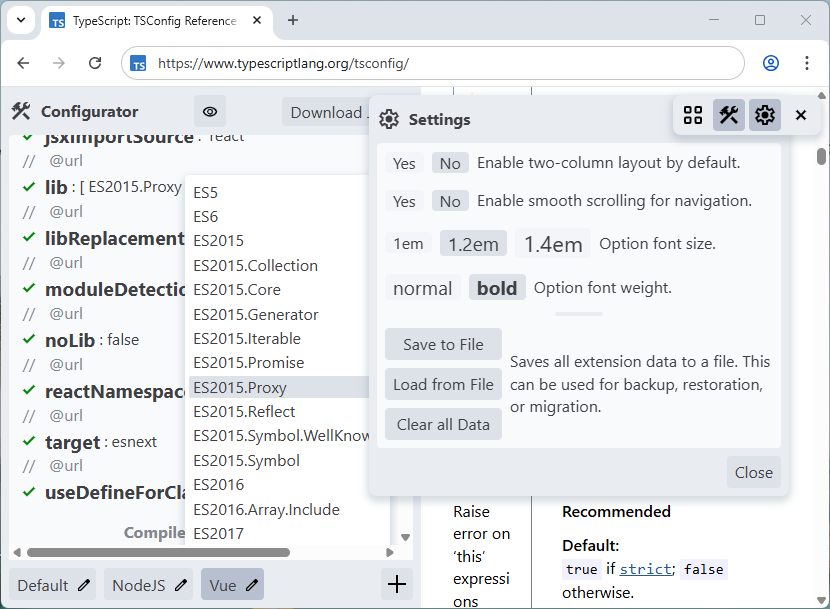
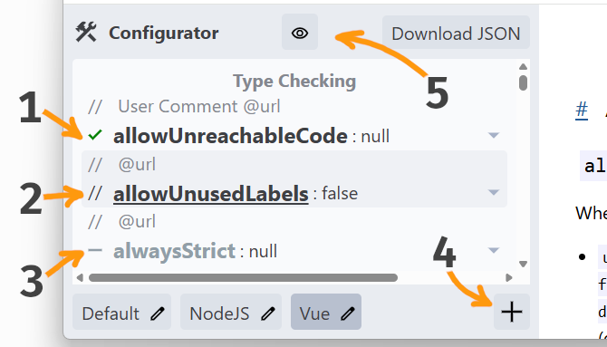

# ⚒️ TSConfig Configurator | TypeScript

Интерактивное расширение для браузера, которое превращает официальную страницу документации [typescriptlang.org/tsconfig](https://www.typescriptlang.org/tsconfig/) в визуальный редактор `tsconfig.json`.

> Расширение работает только на одной странице `typescriptlang.org/tsconfig/`.

## Ключевые возможности

+ **🚀 Интерактивный двухколоночный макет**: Расширение перестраивает страницу в комфортный вид: панель конфигурации слева и оригинальная документация справа. Каждая опция кликабельна и обеспечивает навигацию к своему описанию.
+ **✍️ Редактирование compilerOptions**: Для каждого типа параметра предлагается оптимальный инструмент:
  - Выпадающие списки для `boolean` и `enum`.
  - Поля ввода для `string`.
  - Ввод через запятую для `array`.
+ **📝 Пользовательские комментарии**: Добавляйте свои комментарии к любой опции. Используйте метку `@url`, чтобы автоматически вставить ссылку на официальную документацию.
+ **🔬 Полный контроль над опциями**: Каждая опция может находиться в одном из трех состояний:
  - **Включена(см. пункт 1 на скриншоте)**: Будет добавлена в итоговый `tsconfig.json`.
  - **Закомментирована(см. пункт 2 на скриншоте)**: Добавлена, но закомментирована.
  - **Игнорируется(см. пункт 3 на скриншоте)**: Полностью исключена из файла.
+ 👁️ Кнопка **(см. пункт 5 на скриншоте)** скрывает игнорируемые опции в интерфейсе редактора.

+ **📚 Управление пресетами(см. пункт 4 на скриншоте)**:
  - Создавайте именованные пресеты для разных проектов (например, _NodeJS_, _Vue_).
  - Мгновенно переключайтесь между пресетами.
  - Создание нового пресета копирует текущую конфигурацию.
+ **💾 Автоматическое сохранение**: Все изменения и пресеты автоматически сохраняются в локальном хранилище браузера.
+ **📤 Экспорт и импорт данных**: Экспортируйте пресеты и конфигурации в один JSON-файл. Импортируйте его в другом браузере или поделитесь.
+ **📋 Прямое скачивание**: Скачайте идеально отформатированный файл `tsconfig.json` в один клик.

## Установка

**Упакованные версии:**

* [Google Chrome Web Store](https://chromewebstore.google.com/detail/tsconfig-configurator/ojjanecedkgpkomficakiomnjlobbgkc)
* [Firefox Browser Add-ons](https://addons.mozilla.org/en-US/firefox/addon/tsconfig-configurator/)

**Установка из репозитория:**

* Клонировать репозиторий и установить зависимости `npm i`.
* Собрать в каталог _"dist"_ `npm run build` или `npm run build:dev`(с картой _content.js.map_).
* Установить на вкладке _chrome://extensions/_
